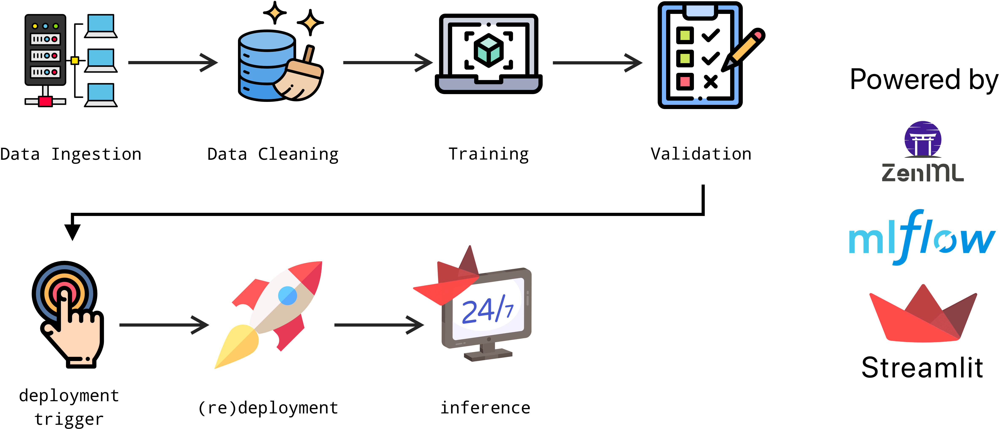

# Running a simple ML pipeline, monitoring and making inference

- First the data is ingested and cleaned, then the model is trained, and evaluated. If data source changes or any hyperparameter values changes, deployment will be triggered, and the model is (re)trained; if the model meets minimum accuracy requirement, it will be deployed.
- This app is designed to predict the type of flowers from Iris dataset based on four features using Support Vector Classifier (about [Iris dataset](https://archive.ics.uci.edu/dataset/53/iris)).

Most of the icons are from [flaticon](https://www.flaticon.com).